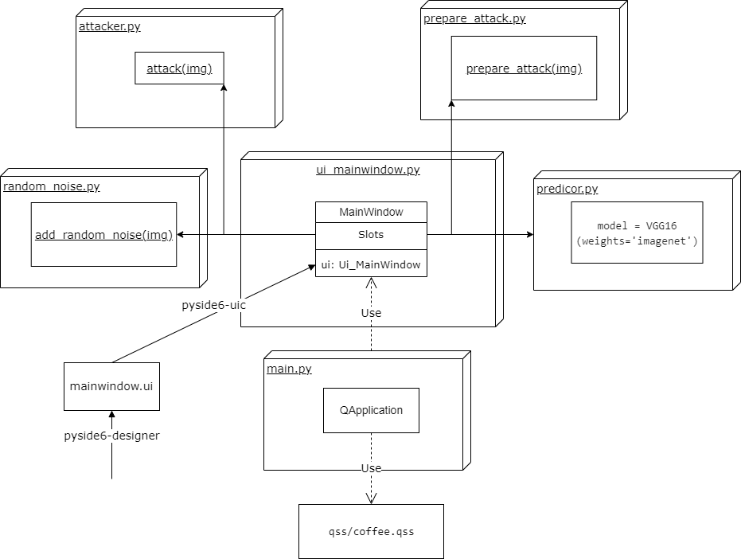

# python-final
The final project of the course Programming in Python at NCU: An adversarial attacker supported in GUI
## Screenshot


## Diagram of architecture


## Issues to be solved in the future?
1. Attack will results in errors if ```use_cuda = False``` is set in line 37, attacker.py. Therefore, if you don't have CUDA-supported GPU, then the Attack function won't work. See the below section ["Environment"](https://github.com/sShaAanGg/python-final#environment) for more information.
2. Launching the application (python3 main.py) takes more than 5 seconds to load the modules and models

## Running the application
```
python3 main.py
```

## Virtual environment
### Creation
```
python3 -m venv project
```
### Activation
On unix-like OS (in bash or zsh)
```
source project/bin/activate
```
On Win10 (in powershell or cmd)
```
.\project\Scripts\activate.bat
```
## Installing project requirements
```
pip install -r requirements.txt
```

## References
https://keras.io/api/applications/resnet/#resnet50-function  
https://www.tensorflow.org/api_docs/python/tf/keras/preprocessing/image/ImageDataGenerator  
https://www.tensorflow.org/api_docs/python/tf/keras/utils/load_img  
https://www.tensorflow.org/api_docs/python/tf/keras/utils/img_to_array  
https://www.tensorflow.org/api_docs/python/tf/keras/applications/resnet50/preprocess_input  
[Source of coffee.qss](https://code.qt.io/cgit/qt/qtbase.git/tree/examples/widgets/widgets/stylesheet/qss/coffee.qss?h=6.3)  
[Qt for Python Official Website](https://doc.qt.io/qtforpython/index.html)

## Environment
**CUDA must be installed and enabled [(CUDA Toolkit 11.7 Downloads)](https://developer.nvidia.com/cuda-downloads), otherwise attack() will result in errors**
1. Linux Distribution: Ubuntu-20.04  
Kernel version: 5.10.102.1-microsoft-standard-WSL2

2. Windows 10 21H2 build 19044.1706

## Python files

#### main.py
main.py is the entry point of gui application  
It will import MainWindow() from ui_mainwindow.py and then display it.
#### ui_mainwindow.py
The class Window is responsible for display image and buttons.  
QImageReader.read() returns a QImage and then _set_image(QImage) will set the QLabel and display the QLabel image.  
**dialog.selectedFiles()[0]** will be the absolute path of the selected file.  
The selected image file will be opened or saved.  

#### mainwindow.ui
ui file is generated by pyside6-designer which is a GUI designer.  
ui_mainwindow.py is generated by pyside6-uic which is a (*.ui) XML compiler.
